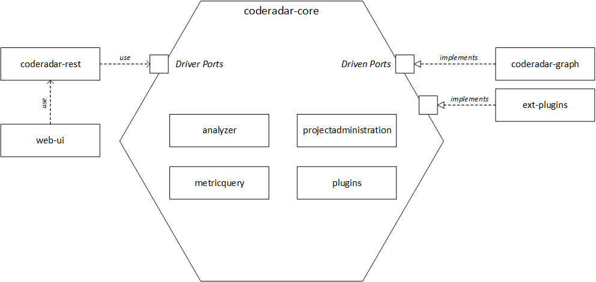

# Contributing to coderadar

Thanks for donating your time to developing coderadar! 
This is the most valuable contribution you can make.

This guide gives an overview of coderadar and some development guidelines to make it easier for new contributors to get up and running.
If you have any questions, feel free to get in touch.

## Overview of coderadar components

Coderadar is divided into two major components _coderadar-core_ and _coderadar-plugin_.
Internally the components are subdivided into further components.
The complete architecture can be seen in the image.



- **coderadar-core** - Contains the business logic of coderadar. Has no dependencies on external resources.
	- **analyzer** - Responsible for managing Git repositories and analyzing files.
	- **projectadministration** - Responsible for the management of coderadar projects.
	- **metricquery** - Responsible for read-only access to all software metric-relevant data.
	- **plugins** - Responsible for the plugins, which in turn are responsible for offering software metrics.
- **coderadar-graph** - Adapter for accessing the graph database Neo4j.
- **ext-plugins** - Adapters for accessing external plugins that offer software metrics.
- **coderadar-rest** - Adapter that provides a REST interface to access coderadar.
- **web-ui** - Angular-Front-End.

_coderadar-core_ offers interfaces via ports that can be used or implemented by the adapters.
_Driver adapter_ (for example REST-API, CLI, etc.) use the _Driver ports_ provided by _coderadar-core_.
_Driven adapters_ (databases, etc.) implement the _Driven ports_ offered by _coderadar-core_.

## How can I contribute?

Any kind of contribution is welcome as a pull request.
If you are unsure on how to fork a repository and then create a pull request from your fork, please read [this blog post](https://reflectoring.io/github-fork-and-pull/) for a quick guide.

### Pick an issue

If you want to help develop coderadar, you can select one of the issues from the [issue tracker](https://github.com/reflectoring/coderadar/issues).
Issues marked with the label [_up-for-grabs_](https://github.com/reflectoring/coderadar/issues?q=is%3Aissue+is%3Aopen+label%3Aup-for-grabs) provide an easy way to start developing coderadar.

### Submit an issue

If you have found a feature suggestion or bug, you are welcome to add it to the [issue tracker](https://github.com/reflectoring/coderadar/issues).
If you want, you can also implement the issue yourself.

## Conventions

Below are some hints on conventions used in this project.
If you are unsure about any, just get in touch.
During a pull request review, we will also check these conventions.
Fear not, the worst thing that may happen if you do not follow them is that we might propose some changes to a pull request you submitted.

### Git Workflow

Nice that you want to help with the development of coderadar.
We have a special _Git Workflow_ to make the development as easy as possible for everyone.
If you want to fix a bug or add a feature, create a fork and work on it.
Create a separate branch for each bug / feature.
How to fork coderadar and create a PR can be found in [this blogpost](https://reflectoring.io/github-fork-and-pull/).
You can also create a PR if you are not finished with the development yet.
This will allow others to see what bug/feature you are currently working on.
Create a draft PR and avoid such constructs as WIP in the title or description.
You can find out how to do this in the GIF.


When committing, you should follow the following rules (see [this blog post](https://chris.beams.io/posts/git-commit/) for more information):

1. Separate subject from body with a blank line
2. Limit the subject line to 50 characters
3. Capitalize the subject line
4. Do not end the subject line with a period
5. Use the imperative mood in the subject line
6. Wrap the body at 72 characters
7. Use the body to explain what and why vs. how
8. Reference the relevant issues

Here's the example from the blog post for a good commit:

```
Summarize changes in around 50 characters or less

More detailed explanatory text, if necessary. Wrap it to about 72
characters or so. In some contexts, the first line is treated as the
subject of the commit and the rest of the text as the body. The
blank line separating the summary from the body is critical (unless
you omit the body entirely); various tools like `log`, `shortlog`
and `rebase` can get confused if you run the two together.

Explain the problem that this commit is solving. Focus on why you
are making this change as opposed to how (the code explains that).
Are there side effects or other unintuitive consequences of this
change? Here's the place to explain them.

Further paragraphs come after blank lines.

 - Bullet points are okay, too

 - Typically a hyphen or asterisk is used for the bullet, preceded
   by a single space, with blank lines in between, but conventions
   vary here

If you use an issue tracker, put references to them at the bottom,
like this:

Resolves: #123
See also: #456, #789
```

### Styleguide

For java code style, the gradle plugin ["spotless"](https://github.com/diffplug/spotless) has been included in the build to enforce the [Google Java Code style](https://google.github.io/styleguide/javaguide.html).
Builds will fail if  the code does not comply to the style guide.
To apply the style guide simply call  `gradlew spotlessApply`.
Only after applying the style guide should you push your changes.

**Hint:** in order for automatic style guide enforcement to work, you have to **disable** automatic code formatting on check-in in your IDE!

### Documentation

Please keep documentation up-to-date when changing the code.
Documentation is made up of the following elements:

- Documentation of the REST API.
This documentation is made with [AsciiDoctor](http://asciidoctor.org/) and [Spring RestDocs](https://projects.spring.io/spring-restdocs/).
Example requests and responses are generated automatically from the integration tests covering the REST controllers.
The documentation files are [here](https://github.com/reflectoring/coderadar/tree/master/coderadar-server/coderadar-core/src/main/asciidoc).
- README.md files in the folders of all main components
- Javadoc: please provide sensible javadoc of at least public API
- This contribution guide: this guide is not carved in stone, so when things change, change this guide. 
  
## Getting Started

### Building coderadar

Simply run `gradlew build`.

### Starting the coderadar server

- Download [Neo4j](https://neo4j.com/download-center) (for example the Community Server).
- Install Neo4j. You can see how it works [here](https://neo4j.com/docs/operations-manual/current/installation/).
- Start the Neo4j server and set up an administrator password.
- Copy the file `coderadar-server/local.application.properties.template` into a file named `local.application.properties`
in the same folder and edit the configuration parameters in that file for your local environment and database.
- Run `gradlew bootrun` from the project directory.
- The coderadar server will be accessible on `localhost:8080` by default.

### Accessing the coderadar REST API

- Start the server.
- Install a REST client like [DHC](https://client.restlet.com/) or [Insomnia](https://insomnia.rest/).
- Refer to the [REST API documentation](https://cdn.rawgit.com/reflectoring/coderadar/gh-pages/current/docs/restapi.html) to see what calls you can make and submit them using your REST client.
